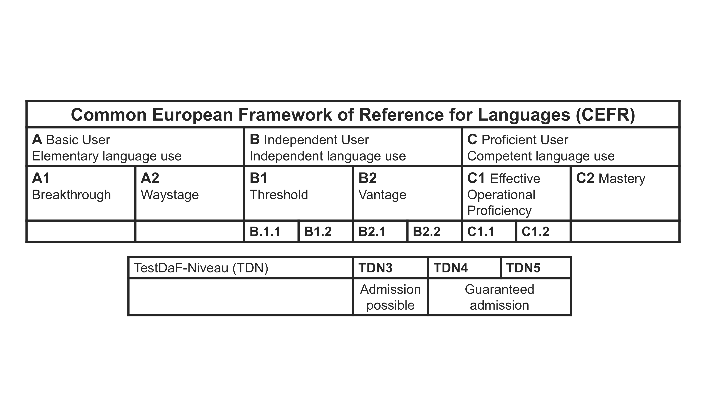

# QUEST V1 APP
## Question Understanding, Evaluation and Speech Training

This repository, developed by Stefan Pietrusky, is based on the QUEST prototypes. The app lets users choose a topic and language, generates a spoken question via an LLM and Text-to-Speech, and plays it back. Users respond by uploading or recording audio, which is transcribed with Whisper, edited if needed, and then sent back to the server. The LLM analyzes the answer, returns written feedback (also converted to speech), and the user can reset the session to start over.

The application is currently being tested and further developed in studies.

## QUEST Structure
The structure of the current [V1] QUEST app is shown below.


## QUEST working principle
Below is a short GIF showing the structure and function of the app.


## QUEST feedback criteria
In this version, the QUEST app's feedback is based on the specifications of the Common European Framework of Reference for Languages (CERF). Depending on the application, this can be adapted in the framework's code.



## Installing and running the application 
1. Clone this repository on your local computer: 
```bash 
git clone https://github.com/stefanpietrusky/QUEST.git
```
2. Install the required dependencies:
```bash 
pip install -r requirements.txt
```
3. Install [Ollama](https://ollama.com/) and load the default model [Llama3.2](https://ollama.com/library/llama3.2) (3B). Alternatively, another model can be used. In this case, the reference in the code must be adjusted.
```bash 
ollama pull llama3.2
```
4. Install Python [3.10.11](https://www.python.org/downloads/release/python-31011/).
5. Adjust the Edge TTS [voice](https://gist.github.com/BettyJJ/17cbaa1de96235a7f5773b8690a20462) as needed.

6. Start the QUEST app:
```bash 
python app.py
```
